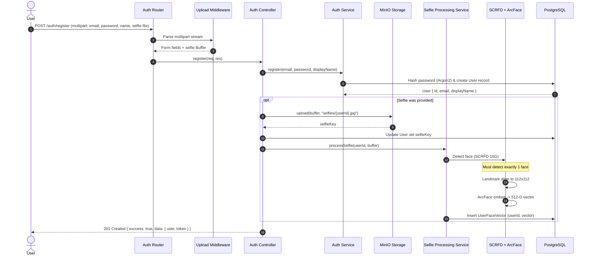
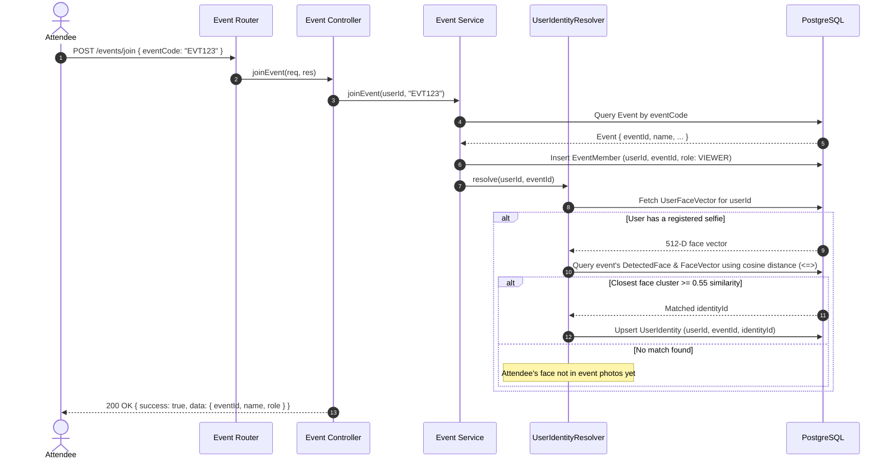
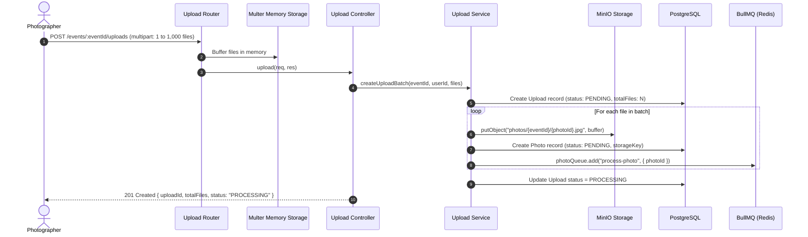
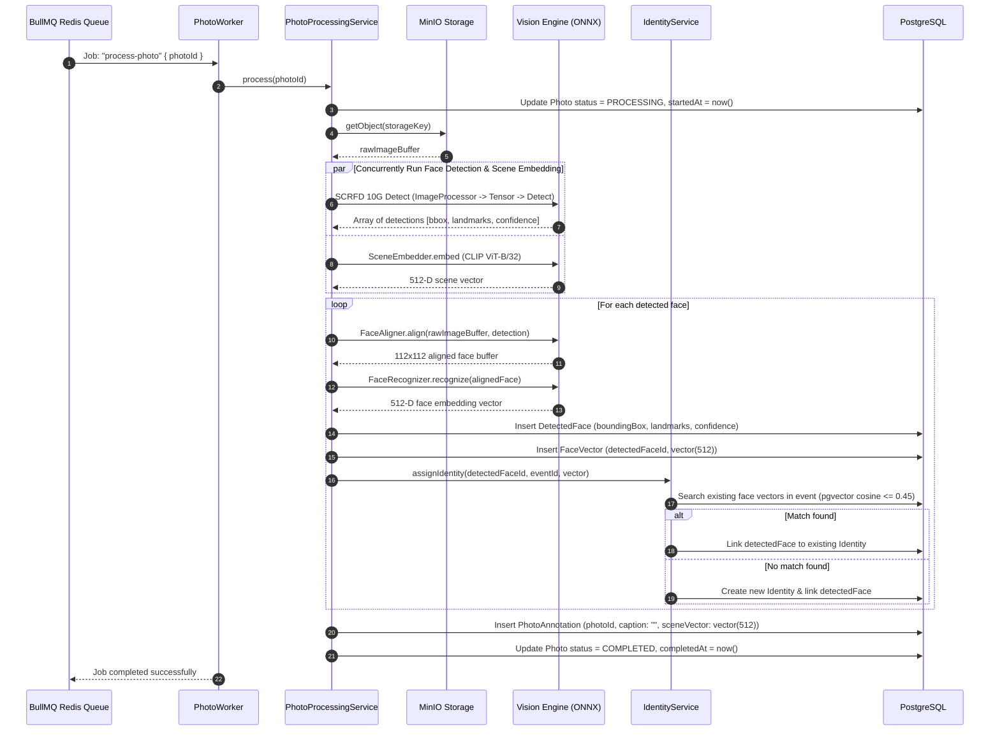
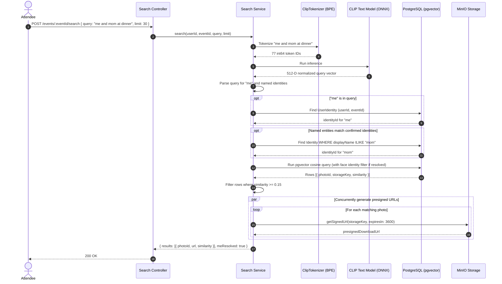

# Data Flow & Transaction Lifecycles

This document outlines the end-to-end data lifecycle across all major workflows in Intellery, showing how data moves across controllers, services, database tables, object storage, and background workers.

---

## 1. User Registration with Selfie

---

## 2. Event Creation & Member Joining

---

## 3. Bulk Photo Upload Flow

---

## 4. Asynchronous Photo Processing Pipeline

---

## 5. Multimodal Natural Language Search Flow

