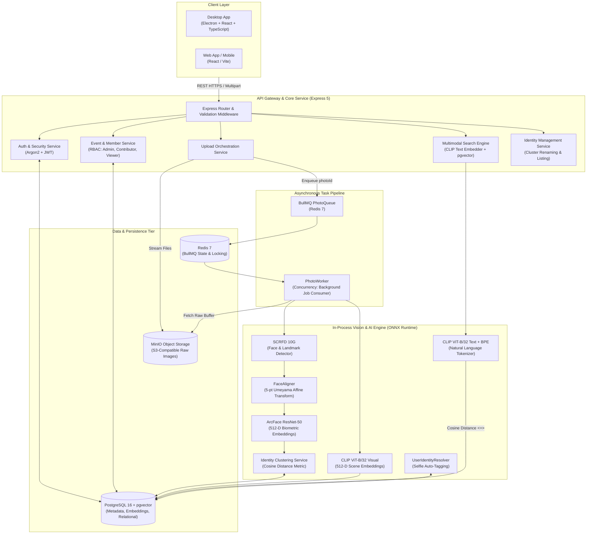

# System Overview

## Purpose

**Intellery** is an AI-powered visual intelligence and event photography platform designed for photographers, event organizers, and attendees. It solves the massive friction of manually organizing, sorting, and retrieving photos from large events (weddings, conferences, festivals, and parties).

The platform automatically:
1. Ingests bulk event photography (up to 1,000 photos per batch).
2. Detects, aligns, and extracts 512-dimensional facial biometric embeddings using deep learning models.
3. Groups unidentified faces into event-specific identity clusters.
4. Matches registered attendees to their face clusters via a single registration selfie.
5. Generates 512-dimensional scene embeddings via OpenAI CLIP (ViT-B/32).
6. Powers natural language queries (e.g. *"me laughing on stage"*, *"mom cutting the cake"*) combining biometric identity resolution with semantic scene retrieval.

---

## High-Level System Topology

---

## Core Component Responsibilities

### 1. API Service (`apps/api`)
- **Framework:** Express 5 in ES Module (ESM) mode, compiled with TypeScript.
- **Dependency Injection:** Centralized composition root (`composition/index.ts`) managing singletons, loaded model sessions, database clients, and service instances.
- **Authentication & Authorization:** JWT Bearer authentication with role-based access control (`ADMIN`, `CONTRIBUTOR`, `VIEWER`) per event.
- **Validation:** Strict runtime boundary validation on headers, params, query strings, and request bodies using **Zod**.
- **Error Handling:** Standardized error hierarchy translating domain errors (`FaceNotDetectedError`, `MultipleFacesError`, etc.) into structured JSON responses with HTTP status codes and machine-readable error codes.

### 2. Storage Subsystem (`apps/api/src/storage`)
- **Primary Database:** PostgreSQL 16 with the `pgvector` extension.
  - Stores all relational data (Users, Events, Members, Uploads, Photos, Detected Faces, Identities).
  - Stores high-dimensional vector embeddings (`vector(512)`) for face vectors and scene annotations.
- **Object Storage:** MinIO (S3-compatible).
  - Stores raw image files uploaded by users. Images are never stored in PostgreSQL.
  - Client retrieval is mediated via temporary presigned URLs (`getSignedUrl`), ensuring access control and reducing API bandwidth.

### 3. Asynchronous Queue & Workers (`apps/api/src/infrastructure/queue`)
- **Engine:** BullMQ backed by Redis 7.
- **Decoupled Processing:** When a photographer uploads 500 images, the API writes photo records in `PENDING` state, uploads raw files to MinIO, enqueues jobs to `PhotoQueue`, and returns an immediate `201 Created` response.
- **Worker Execution:** `PhotoWorker` pulls jobs asynchronously, transitions photo state to `PROCESSING`, runs the vision pipeline, persists embeddings to PostgreSQL, and updates state to `COMPLETED` (or `FAILED` with an error trace).

### 4. In-Process AI & Vision Engine (`apps/api/src/vision`)
- **Runtime:** `onnxruntime-node` (native C++ bindings to ONNX Runtime).
- **Zero-IPC Architecture:** Rather than paying network and serialization latency to an external Python microservice, all models execute in-process directly on the Node.js event loop thread pool or native worker threads.
- **Models Loaded at Boot:**
  1. `scrfd_10g_bnkps.onnx`: High-accuracy multi-scale face detection with 5-point facial landmarks.
  2. `w600k_r50.onnx`: ArcFace ResNet-50 face recognition model producing 512-D L2-normalized embeddings.
  3. `vision_model.onnx`: OpenAI CLIP ViT-B/32 vision transformer generating 512-D image scene embeddings.
  4. `text_model.onnx` + `vocab.json` + `merges.txt`: OpenAI CLIP text encoder with custom in-process Byte-Pair Encoding (BPE) tokenizer.

---

## Data Segregation & Security Model

1. **Event Isolation:** Face clusters and identity mappings are strictly scoped to `eventId`. Attendees in Event A cannot be identified or searched across Event B unless explicitly enrolled in Event B.
2. **Presigned Access:** Photos are stored in private MinIO buckets. Access URLs expire within 1 hour (3,600 seconds) and require active event membership.
3. **Biometric Privacy:** Facial embeddings are mathematically irreversible 512-dimensional representations. Raw selfie uploads can be strictly managed, and vector comparisons are bounded to the event scope.