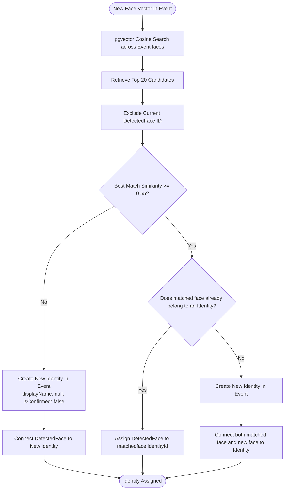

# AI & Computer Vision Workflows

This document visualizes the internal logic of the computer vision pipeline, face clustering decisions, and multimodal query resolution.

---

## 1. Asynchronous Photo Processing Workflow

```mermaid
flowchart TD
    Start([Job: process-photo {photoId}]) --> FetchPhoto[Fetch Photo Metadata from DB]
    FetchPhoto --> UpdateProcessing[Set Photo status = PROCESSING]
    UpdateProcessing --> DownloadMinio[Download Image from MinIO]

    DownloadMinio --> ForkParallel{Parallel Execution}
    
    ForkParallel -->|Branch A: Face Pipeline| SharpFace[ImageProcessor.toTensor: Max 640x640, Normalization]
    ForkParallel -->|Branch B: Scene Pipeline| SharpScene[SceneEmbedder: 224x224 RGB, ImageNet Normalization]

    SharpScene --> CLIPVision[CLIP ViT-B/32 Vision Model ONNX]
    CLIPVision --> SceneVector[(512-D L2-Normalized Scene Vector)]

    SharpFace --> SCRFD[SCRFD 10G Detection Model ONNX]
    SCRFD --> NMS[Post-Processing: Score >= 0.5, IoU NMS <= 0.4]
    NMS --> CheckFaces{Any Faces Detected?}

    CheckFaces -->|No| PersistScene
    CheckFaces -->|Yes| LoopFaces[Iterate Detected Faces]

    subgraph FaceLoop["Per-Face Sequential Loop"]
        LoopFaces --> Align[FaceAligner: Umeyama 5-point Affine Transform]
        Align --> Crop112[112x112 Normalized RGB Face Crop]
        Crop112 --> ArcFace[ArcFace ResNet-50 Model ONNX]
        ArcFace --> FaceVector[(512-D L2-Normalized Face Vector)]
        FaceVector --> SaveDetectedFace[Insert DetectedFace & FaceVector in DB]
        SaveDetectedFace --> IdentitySvc[IdentityService: Assign or Create Identity Cluster]
    end

    IdentitySvc --> LoopDone{More Faces?}
    LoopDone -->|Yes| LoopFaces
    LoopDone -->|No| PersistScene

    PersistScene[Insert PhotoAnnotation with Scene Vector] --> UpdateComplete[Set Photo status = COMPLETED]
    UpdateComplete --> End([Job Done])
```

---

## 2. Incremental Identity Clustering Decision Tree



---

## 3. Multimodal Search Resolution Flowchart

```mermaid
flowchart TD
    UserQuery([Query: 'me and mom on the stage']) --> Tokenize[ClipTokenizer: Regex BPE Tokenization to 77 IDs]
    Tokenize --> TextEncoder[CLIP Text Transformer ONNX Model]
    TextEncoder --> QueryVector[(512-D Normalized Text Vector)]

    UserQuery --> ParseQuery{Parse Keywords}
    ParseQuery --> CheckMe{Contains 'me'?}
    CheckMe -->|Yes| LookupMe[Lookup UserIdentity for userId in eventId]
    LookupMe --> AddMeID[Append user identityId to filter]
    CheckMe -->|No| CheckNames

    AddMeID --> CheckNames{Query words match confirmed identities?}
    CheckNames -->|Yes| LookupNames[Query Identity WHERE displayName ILIKE word]
    LookupNames --> AddNameIDs[Append matched identityIds to filter]
    CheckNames -->|No| ExecuteSearch

    AddNameIDs --> ExecuteSearch{Are any identities resolved?}

    ExecuteSearch -->|Yes: Hybrid Face + Scene| QueryFiltered[pgvector Query with Face Filter:\n1 - (pa.vector <=> queryVector) AS similarity\nWHERE df.identityId = ANY(resolvedIdentities)]
    ExecuteSearch -->|No: Pure Scene Search| QueryPure[pgvector Query across all Event Photos:\n1 - (pa.vector <=> queryVector) AS similarity]

    QueryFiltered --> FilterThreshold[Filter similarity >= 0.15]
    QueryPure --> FilterThreshold

    FilterThreshold --> SignURLs[Generate MinIO Presigned URLs for Photos]
    SignURLs --> ReturnResults([Return Search Results + meResolved Flag])
```
