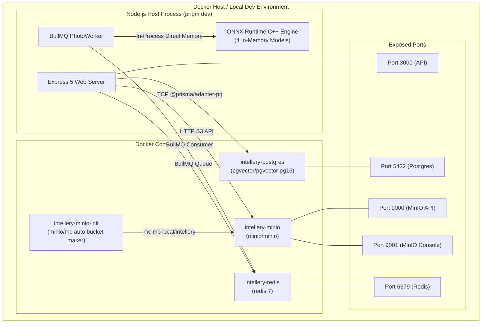
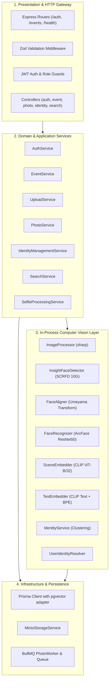

# System Architecture Diagrams

This document collects architectural and structural diagrams illustrating the deployment and runtime topology of Intellery.

---

## 1. Container & Deployment Topology

---

## 2. Layered Software Architecture

