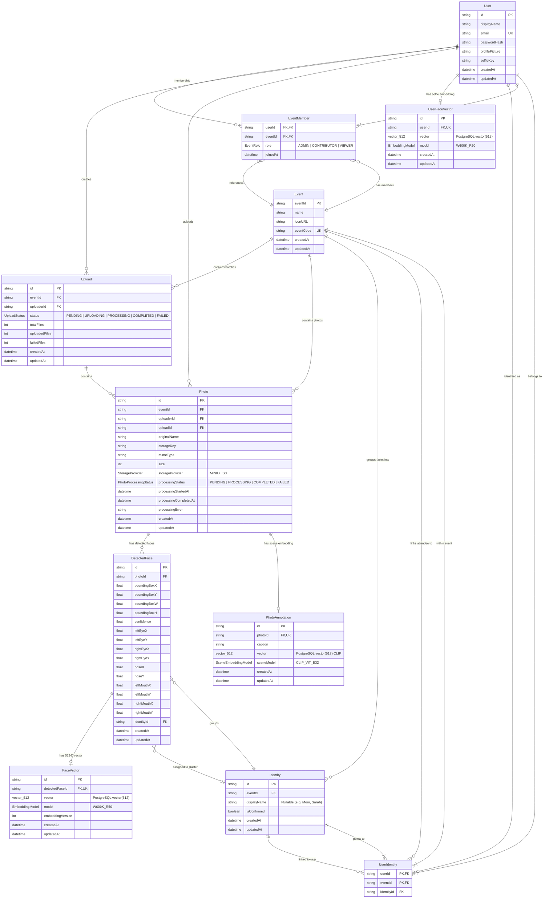

# Database Entity-Relationship Diagram (ERD)

This document provides a detailed visual diagram of the PostgreSQL relational schema and vector storage structure managed by Prisma and `pgvector`.

---

